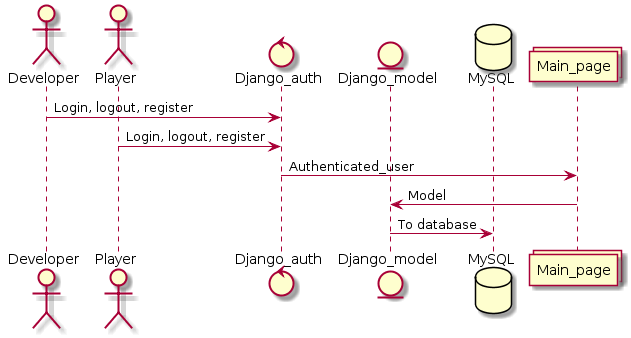

# WSD-Final-Project-AkShBe

The final project "Online game store for JavaScript games" for Web Software Development course

# Members:
Akzharkyn Duisembiyeva 727406  
Ahmed Ali Bedair 7 27176  
Shamim Biswas 727228

# Application overview:
## Application topic:
Online game store for JavaScript games  
## Features of application:
Register as a player and developer  
As a developer: add games to their inventory, see list of game sales  
As a player: buy games, play games, see game high scores and record their score to it  

# Models:
## Game
date_updated = models.DateTimeField(auto_now=True)  
players = ArrayField(ArrayField(CharField(max_length=64)))

## Developer
name = models.CharField(max_length=64)  
earned_money = models.CharField(max_length=64)

## Player
name = models.CharField(max_length=64)  
credit_card_info = models.CharField(max_length=64)
inventory_games = models.CharField(max_length=64)

# Views
## Game
1. Play game
2. Update the game with new version, delete game
3. View all games
4. Get the rank of players
5. Get the rank of developers

## Game service
1. Update the rank of players with highest score
2. Get and process messages: save/load game state messages, error messages, messages for configuration changes 

## Developer
1. Profile of developer which shows how much money and which games were done by this developer. Should be visible for develoepr only.
2. Place your game - this page allows developers with put the urls to their games and share it with player.
## Player
1. Profile of player which shows the credit card information and credentials of player. Should be visible for player only.
2. Purchase a game
3. Message other players

# Security threat analysis
The following security issues should be considered during complation of project: 
1. Stealing users' payment data
2. Updating users' credentials
3. Impersonating a player
4. Modifying requests to gaming service as changing the highest score, loading/modiying exsiting games' data
5. Removing game form service, which can be performed by completing developers
6. Stealing developers' payment data
7. Updating develoeprs' credentials
8. Impersonating a developer

# Working methods:
1. Regular face-to-face meetings, Skype conferences, using messaging applications for tracking the progress
2. The verification of code must be done by 1 or 2  members before the user can merge their branch dedicated to one frature into master 
3. Enabling continuous integration (Built-in CI tool ) and deployment (Heroku), where the deployment of app is triggered automatically after the tests have passed successfully. Contunous checking of branches and testing should be enabled.

# Implementation steps:
frontend - initial design with HTML pages will be implemented. After the completion of logic and functionality of app, the improvement on frontend will be done.  
backend - this will focus on logic of the full application and will be changed and improved throughout the completion of project.  
security - the authentication, storing the user’s bank credentials, the asset for developers will be enabled. Further, the penetration tests will be performed to test the viability, stability and functionality of our application.

# Timetable:
The project needs to be completed by the end of 3rd term. The general milestones are determined as follows:  
19.1 - End of backend functionality, proper testing of backend, logic of game  
10.2 - Improving the frontend of application, resolving security issues  
19.2 - Testing of full application and deploying in Heroku  

